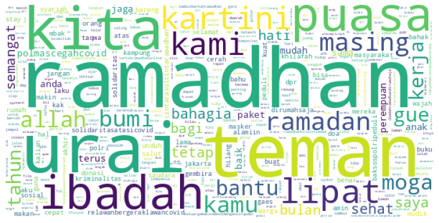

# Analisis Sentimen Twitter Corona DKI Jakarta


[](https://www.python.org/)
[](https://github.com/Hyuto/Analisis-Sentimen-Corona-DKI-Jakarta/actions/workflows/testing.yaml)
[](https://github.com/Hyuto/Analisis-Sentimen-Corona-DKI-Jakarta/actions/workflows/linting.yaml)
[](https://codecov.io/gh/Hyuto/Analisis-Sentimen-Corona-DKI-Jakarta)

Analisis Sentimen Twitter untuk mengetahui Dampak dari Pandemi COVID-19 terhadap masyarakat Jakarta
menggunakan TF-IDF Vectorizer &amp; SVM

|                                          |                                          |
| :--------------------------------------: | :--------------------------------------: |
|  |  |

## Web Application

Anda dapat mencoba model yang sudah dilatih dari penelitian ini secara langsung di
[Sentiment Detector](https://hyuto.github.io/showcase/sa-corona)

## Setup

Setup local environment. Pertama clone/download repo ini. Selanjutnya, buat _virtual environments_ dan aktifkan. Kemudian install dependencies pada `requirements.txt`.

```bash
$ pip install -r requirements.txt
```

## CLI

Mengakses setiap feature yang ada lewat CLI.

```bash
python -m src --help
```

1. Scraping twitter menggunakan `snscrape`

   Melakukan scraping data twitter terkait topik apapun dengan menggunakan library `snscrape`.

   ```bash
   python -m src scrape --help
   ```

   **Contoh**

   Scraping data twitter terkait minyak di DKI Jakarta.

   ```
   query="minyak"
   geocode="-6.213621,106.832673,20km" # geocode-Jakarta
   max-results=5000 # maksimal-tweet
   export="minyak" # export-scraping
   ```

   ```bash
   python -m src scrape "minyak" \
      --geocode "-6.213621,106.832673,20km" \
      --max-results 5000 \
      --export "minyak"
   ```

2. Model Testing

   Testing model yang sudah dilatih sebelumnya sembari melakukan scraping data twitter
   terkait topik corona dengan menggunakan library `snscrape`.

   ```bash
   python -m src model-test --help
   ```

   **Contoh**

   Mendetect tweet tentang covid di kota Malang

   ```
   query="#corona OR covid OR Covid19 OR #DiRumahAja OR #quarantine OR Corona OR DiRumahAja OR wabah OR pandemi OR quarantine"
   geocode="-7.97712,112.63403,20km" # geocode-Malang
   max-results=5000 # maksimal-tweet
   export="covid" # export-scraping
   ```

   ```bash
   python -m src model-test \
      --geocode "-7.97712,112.63403,20km" \
      --max-results 5000 \
      --export "covid"
   ```

3. ONNX Model Converter

   Convert model yang sudah terlatih dalam bentuk pickle ke `onnx`.

   ```bash
   python -m src convert-onnx --help
   ```

© 2020 Wahyu Setianto
